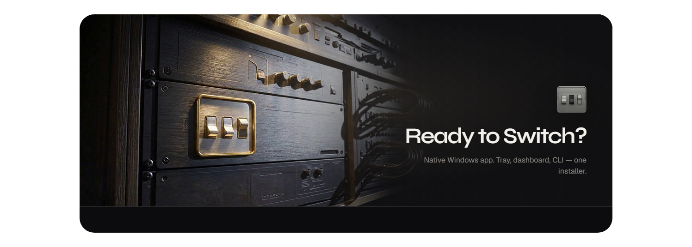
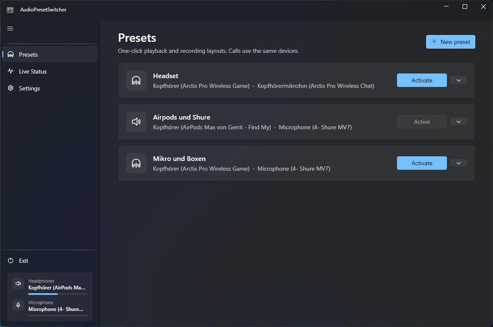

# AudioPresetSwitcher

Windows 11 system-tray app that switches default playback and recording devices with one click. Presets are edited in a Fluent dashboard — never in a JSON file.

**Landing page:** [gerritgutzeit.github.io/windows-audio-router](https://gerritgutzeit.github.io/windows-audio-router/)

Closing the window hides the app to the tray. Exit is only available from the sidebar footer or the tray menu.



## Features

- Card-based preset manager (create, edit, duplicate, delete, activate)
- Live device status with volume and peak meters
- Dark / light / system theme, Mica backdrop
- Tray menu with a checkmark on the active preset
- CLI for Stream Deck and other automation
- Optional Windows toast when a preset is applied
- Optional start with Windows
- Installer and auto-updates via [Velopack](https://velopack.io/) (GitHub Releases)

Devices are matched by a **keyword** against the current Windows `FriendlyName` (for example `Wireless Headset` or `Audio Interface XYZ`). That survives USB/Bluetooth reconnects, which change the internal device GUID.

Applying a preset sets multimedia **and** communications defaults (Teams, Discord, and similar) to the same playback and recording devices.

## Requirements

- Windows 10 1809 or later (Windows 11 recommended)
- For a Release install: nothing else — Setup is self-contained
- For building from source: [.NET 8 SDK](https://dotnet.microsoft.com/download/dotnet/8.0)

## Install from GitHub Releases

1. Open the [Releases](../../releases) page.
2. Download **`AudioPresetSwitcher-win-Setup.exe`** (Velopack installer) and run it.
3. Launch from the Start menu shortcut.

The app checks GitHub Releases for updates in the background. When a new version is ready, open **Settings** and choose **Restart and update** (or use **Check for updates**).

Windows SmartScreen may warn on the first launch because the binary is not code-signed. Choose **More info** → **Run anyway** if you built or downloaded it from this repository.

Settings live in:

```text
%AppData%\AudioPresetSwitcher\settings.json
```

That file is created automatically. Do not edit it by hand unless you know what you are doing.

Installed binaries live under:

```text
%LocalAppData%\AudioPresetSwitcher\current\
```

## Usage

### Dashboard

| Page | What it does |
| --- | --- |
| **Presets** | List of presets. **Activate** applies devices immediately. Chevron → Edit / Duplicate / Create shortcut… / Delete. |
| **Live status** | Connected playback and recording devices, volume, live levels, default-role badges. |
| **Settings** | Run at startup, theme, toast notifications, updates. |

In the preset editor, pick devices from the dropdowns, then optionally shorten the **match keyword** so it still matches after Windows renames the endpoint slightly.

### System tray

- Left-click: open the dashboard
- Right-click: activate a preset, open the dashboard, or exit

### Command line

If the tray app is already running, a second process forwards the command over a local named pipe and exits. If it is not running, the first instance applies the preset and stays in the tray (no window).

```text
"%LocalAppData%\AudioPresetSwitcher\current\AudioPresetSwitcher.exe" --preset "Desk"
"%LocalAppData%\AudioPresetSwitcher\current\AudioPresetSwitcher.exe" -p "Desk"
"%LocalAppData%\AudioPresetSwitcher\current\AudioPresetSwitcher.exe" --preset-index 0
```

| Flag | Meaning | Exit code |
| --- | --- | --- |
| `--preset` / `-p` | Preset name (case-insensitive) | `0` on success, `1` if missing or switch failed |
| `--preset-index` | Zero-based index in the saved list | same |

Stream Deck: add a **System → Open** action pointing at the installed EXE under `%LocalAppData%\AudioPresetSwitcher\current\`, with arguments `--preset "Headset"`.

From the Presets page, use the chevron menu → **Create shortcut…** to save a Desktop (or other) `.lnk` that launches the same command.

## Build from source

```powershell
dotnet restore AudioPresetSwitcher.sln
dotnet build AudioPresetSwitcher.sln -c Release
```

Self-contained publish folder (input for Velopack packaging):

```powershell
dotnet publish src/AudioPresetSwitcher/AudioPresetSwitcher.csproj -c Release -p:PublishProfile=win-x64
```

Output: `publish/win-x64/`

To build a local installer (requires [`vpk`](https://docs.velopack.io/) 1.2.0):

```powershell
dotnet tool install -g vpk --version 1.2.0
vpk pack -u AudioPresetSwitcher -v 1.0.0 -p publish/win-x64 --mainExe AudioPresetSwitcher.exe --packTitle "AudioPresetSwitcher" --icon src/AudioPresetSwitcher/Assets/app.ico --shortcuts StartMenu -o releases
```

Setup.exe is under `releases/`. GitHub tag pushes (`v*`) run the same flow in CI and upload the Velopack assets.

## How matching works

Each preset stores keywords, not GUIDs.

1. Enumerate active WASAPI endpoints.
2. Keep names that contain the keyword (case-insensitive substring).
3. Prefer an exact name match, then the tightest substring ratio, then the current default if several still tie.
4. Set Console, Multimedia, and Communications roles for the matched playback and recording devices.

If a side has an empty keyword, that side is left unchanged. If a keyword matches nothing, that side is skipped and a toast explains which keyword failed.

## Tech stack

- C# / .NET 8 / WPF
- [WPF-UI](https://github.com/lepoco/wpfui) (Fluent, Mica)
- [H.NotifyIcon.Wpf](https://github.com/HavenDV/H.NotifyIcon)
- [NAudio](https://github.com/naudio/NAudio) (WASAPI enumerate, meters, device watch)
- [Velopack](https://velopack.io/) (installer and auto-updates)
